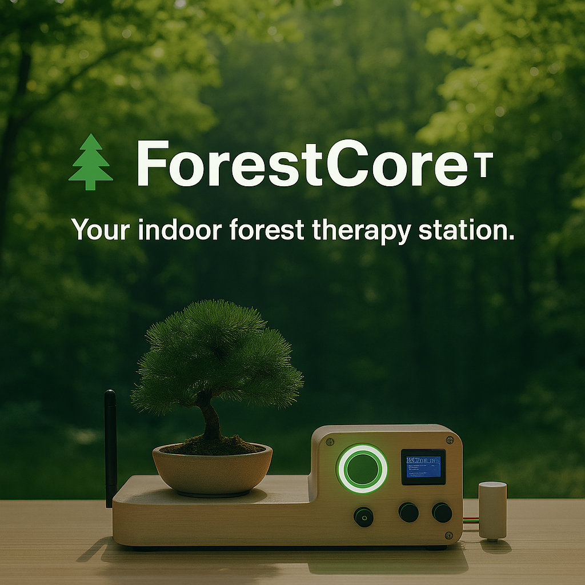

<link rel="stylesheet" href="style.css">

# 🌲 ForestCore™  
**Your indoor forest therapy station.**

> _"Breath meets tech"_ — ForestCore simulates the stress-relieving power of trees by diffusing phytoncides, projecting circadian lighting, and sensing your environment in real-time.

---

### 🧠 What It Does
- 💨 Diffuses stress-reducing forest chemicals (alpha-pinene, limonene)
- 🌡️ Monitors environment: temperature, humidity, light, VOCs
- 🎨 Adjusts ambient light & sounds to mimic forest cycles
- 🧘 Responds to biofeedback and mood conditions

---

### 🛠 Built With
- Arduino Nano 33 IoT
- React + React Native
- BLE, WS2812 LEDs, DFPlayer Mini
- Sensors: DHT22, BH1750, MQ-135

---

### 🚀 Try the Beta
- [🧪 Setup Guide](../README.md)  
- [📦 Download Testing Card](forestcore_testing_card.png)

---

### 🔭 Roadmap to v1.0
- Printable STL enclosure  
- EEPROM memory + usage history  
- Cloud connectivity (MQTT, webhooks)

---

**Open Source Wellness**  
[View on GitHub](https://github.com/williambevans/forestcore)
